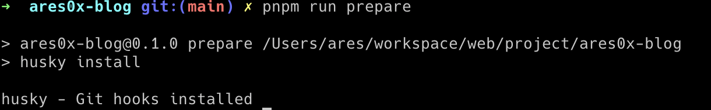
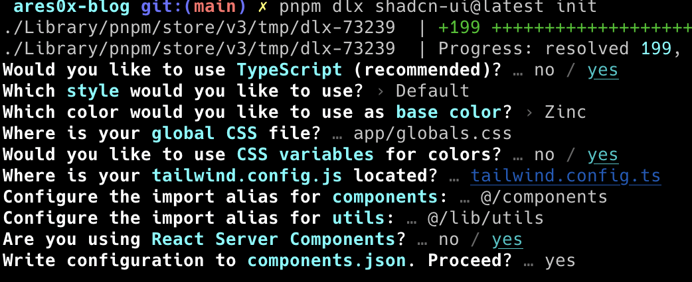

# create-blog-webisite

## create project

```shell
pnpm dlx create-next-app@latest
```

## setup project

install `eslint + prettier + eslint-plugin-prettier`
```shell
pnpm i eslint prettier eslint-plugin-prettier eslint-config-prettier prettier-plugin-tailwindcss -D
```
setup `.eslintrc.json`
```json
{
  "extends": [
    "next/core-web-vitals",
    "eslint:recommended",
    "plugin:prettier/recommended"
  ],
  "env": {
    "es2020":true,
    "es6": true,
    "node": true
  },
  "plugins": [
    "prettier"
  ],
  "rules": {
    "prettier/prettier": "warn"
  }
}
```

create `prettierrc.js`
```js
module.exports = {
  singleQuote: false,
  printWidth: 100,
  semi: true,
  trailingComma: "all", 

  arrowParens: "always",
  bracketSpacing: true, 

  useTabs: false, 
  tabWidth: 2,

  proseWrap: "always", 
  htmlWhitespaceSensitivity: "css", 
  plugins: ["prettier-plugin-tailwindcss"],
};
```

write `prettier` command to `package.json`
```json
 "prettier": "prettier --write \"src/**/*.{js,jsx,ts,tsx}\""
```

install `husky`
```shell
pnpm dlx husky-init && pnpm install
```
run `husky` command
```shell
pnpm run prepare   
```



install `commitlint` && init `commitlint`
```shell
pnpm install  -D @commitlint/{config-conventional,cli}  

echo "module.exports = {extends: ['@commitlint/config-conventional']}" > commitlint.config.js
```

setup `shadcn`
```shell
pnpm dlx shadcn-ui@latest init
```
